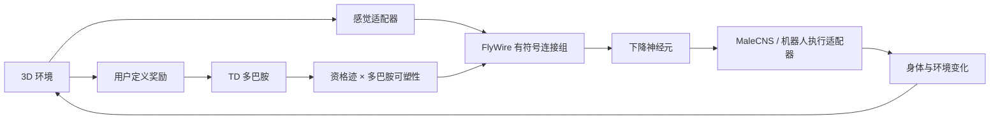

# 架构与神经强化学习说明

## 1. 闭环



训练和部署共用相同的动作定义与感觉语义。训练阶段使用连接组群体模型提高采样速度；生态部署把学习后的群体增益重新映射到 668 神经元 LIF 网络的 18,968 条边，并连接 MaleCNS 运动回路。

## 2. 三因子学习

每个连接组边维护资格迹：

```text
e(t) = λ e(t-1) + pre(t) × (post(t) - post_average)
δ(t) = r(t) + γ V(t+1) - V(t)
g(t+1) = clip(g(t) + η × δ(t) × e(t), g_min, g_max)
```

其中 `e` 是局部活动痕迹，`δ` 是作为多巴胺调制信号的 TD 误差，`g` 是乘在固定连接上的可塑增益。训练不会新增或删除连接，也不会改变兴奋/抑制符号。

## 3. 策略输出

策略头只读取以下下降神经活动：

- DNa01/DNa02 左右转向；
- MDN 后退；
- DNp09 前进；
- DNg11 梳理；
- DNp02/04/11 逃逸翼指令；
- Giant Fiber 逃逸触发；
- 其他下降神经群体。

生态运行时先由策略选择动作意图，再刺激相应下降神经群；实际身体信号继续由 `SignalBuilder` 和 MaleCNS 产生。策略代码不能直接设置已部署果蝇的航向、速度或飞行状态。

## 4. 模型包

`desktop-fly-neural-rl-policy` v2 包含：

- 唯一模型编号；
- 训练世界与全部任务规则；
- 训练指标；
- 连接组版本指纹；
- 神经群定义、基矩阵和学习后增益；
- 下降神经元策略/价值读出；
- 机器人坐标、速度、安全距离、急停和话题配置。

部署时会校验连接组指纹。模型和本机数据版本不一致时拒绝加载，防止把权重错误映射到另一套神经拓扑。

## 5. 现实机器人

桌面生态使用 LIF + MaleCNS。ROS 2 便携运行时执行导出的连接组群体矩阵和下降神经读出，再通过机器人专用动作适配器输出 `Twist`。机器人电机或飞控取代生物肌肉，因此不能把 ROS 路径描述成 MaleCNS 生物运动的直接复制。

## 6. 已知限制

- FlyWire 子图不是整个果蝇大脑；
- 训练采用群体共享增益，不是每个突触独立学习；
- 感觉通道是工程映射；
- LIF 参数、跨标本 FlyWire—MaleCNS 接口、肌肉和空气动力学均为模型；
- 从仿真到真实机器人仍存在传感器噪声、时延、动力学和安全差异。

