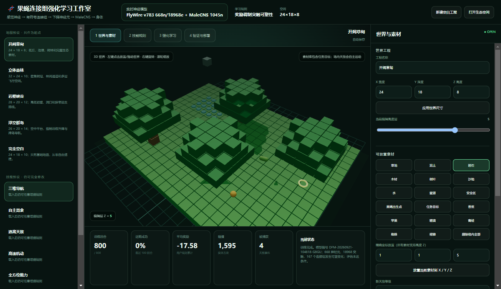
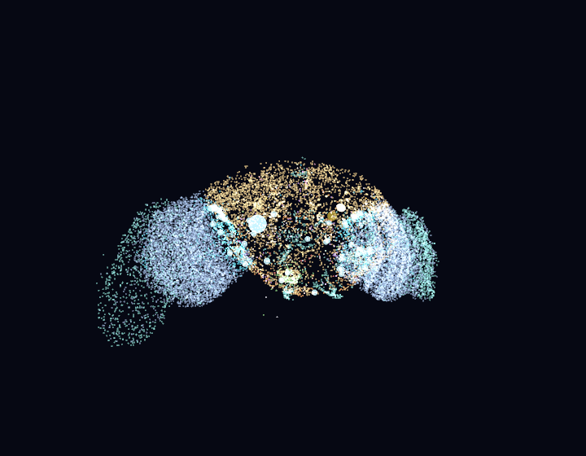
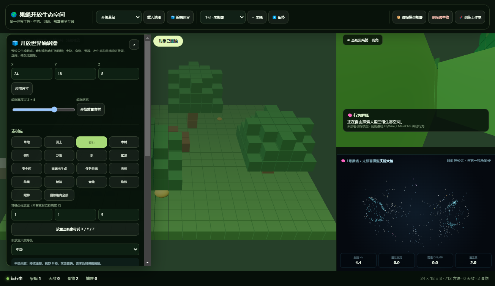

# 微信公众号成稿

## 标题

我把果蝇的连接组装进了一个 3D 世界：它现在可以用强化学习训练技能

## 摘要

一个开源的果蝇连接组具身智能实验室：自由搭建三维生态、定义奖励、训练神经控制器，再部署到指定果蝇或 ROS 2 机器人。

## 封面建议

使用 `docs/images/ecosystem-brain.png`，裁切保留中间三维世界和右下角神经大脑。封面文字建议：

> 让果蝇大脑在 3D 世界里学习

---

很多强化学习演示都有一个共同问题：

智能体在地图里移动得很好，但我们不知道“它的大脑在哪里”。

动作往往只是神经网络输出的几个数字，或者干脆来自一张 Q 表。环境、策略、身体和可视化彼此分离，很难回答一个更有意思的问题：

**如果把真实连接组约束、神经活动、身体运动和三维生态放进同一个闭环里，会发生什么？**

这正是我开源 DesktopFly Neural RL 的原因。

【插图 1：三维训练工作室】

*图注：训练页面中的地图、地形高度、食物、天敌、出生点、任务目标、感觉、动作和奖惩都可以修改。*

## 一、这不是给果蝇套一张 Q 表

项目使用了两套公开连接组数据的派生子图：

- FlyWire v783：668 个神经元、18,968 条有符号连接；
- MaleCNS：1,045 个神经元、17,224 条运动相关连接。

环境中的目标、食物、障碍和天敌，首先被转换成感觉神经输入。活动沿有符号连接组传播，策略只能读取下降神经元的活动，随后再进入 MaleCNS 和身体动力学。

也就是说，部署后的模型不能直接写入“速度 = 50”或者“向右转”。它必须走完这条路径：

> 环境感觉 → FlyWire 神经活动 → 下降神经元 → MaleCNS → 身体 → 新的环境感觉

这个限制很重要。它让“具身”不再只是一个界面标签，而是系统结构本身。

【插图 2：基础大脑可视化】

*图注：神经元位置来自 FlyWire 派生数据；发光活动来自工程化 LIF 神经动力学。*

## 二、奖励如何改变大脑

这次重构参考了 FlyDoom 的连接组强化学习方向，加入了“三因子学习”：

1. 突触两端的神经活动形成局部资格迹；
2. 当前奖励与价值预测形成 TD 误差；
3. TD 误差作为多巴胺调制信号；
4. 只有同时具备活动痕迹和多巴胺信号的连接才会发生变化。

可以把它简化成一句话：

> 刚才活跃过的连接，会根据随后得到的奖励被增强或减弱。

当前版本支持三因子多巴胺学习、Connectome A2C 和 Connectome PPO。训练不会随意新增神经连接，也不会改变兴奋或抑制符号，而是在固定拓扑上学习有边界的群体突触增益。

## 三、地图和任务可以完全自定义

训练场景是一个真正的三维体素空间。你可以选择草地、森林、峡谷等预设，也可以从空白地图开始。

土块、岩石、水、食物、安全区、果蝇出生点、任务目标和天敌都能放到 X/Y/Z 任意合法坐标。青蛙、蜘蛛和螳螂具有不同技能，并分为低、中、高三个捕食等级。

任务同样不是写死的。你可以自由组合：

- 看见什么：位置、目标方向、碰撞、食物、天敌、能量、时间和脑活动；
- 能做什么：六向移动和等待；
- 奖励什么：接近目标、觅食、存活、远离天敌、高度或速度；
- 惩罚什么：碰撞、能耗、被捕获或每一步成本；
- 何时结束：到达目标、吃到指定食物、存活足够时间或达到最大步数。

因此，同一套基础连接组可以训练导航、觅食、逃生、高速机动或多任务技能。

## 四、训练好的模型到底有没有部署成功

这是我特别想解决的一个体验问题。

每次训练完成后，系统都会产生明确的模型编号，例如：

> DFM-20260921-153000-A1B2

模型包还包含连接组指纹、改变了多少组连接、每个增益的数值、下降神经元读出、完整场景和奖励规则。

在生态空间中，你需要先选择模型文件，再选择目标果蝇。部署完成后，页面会明确显示：

- 模型编号；
- 部署到第几号果蝇；
- 训练增益映射到了多少条 LIF 突触；
- 当前动作和累计决策次数。

【插图 3：生态、第一视角与实时大脑】

*图注：左侧是可编辑生态，中上是同一只果蝇的第一视角，右下实时显示这只果蝇的神经活动。*

第一视角跟随哪只果蝇，大脑窗口就显示哪只果蝇。模型部署后，神经活动、动作和身体运动来自同一个运行时，不再是三个互不相关的动画。

## 五、还能部署到现实机器人

导出的模型包包含 ROS 2 配置，可以由连接组群体运行时输出 `Twist` 指令，用于轮式机器人、六足平台或微型无人机的原型验证。

不过必须强调：

现实机器人的电机和飞控不是果蝇肌肉。ROS 2 端执行的是同一连接组群体矩阵和下降神经读出，然后通过机器人动作适配器执行。真实部署仍要面对传感器噪声、定位漂移、动力学差异和时延。

第一次真机测试必须使用独立硬件急停，限制速度，在架空或断开执行器的状态下检查方向，再进入封闭、低速、无人员环境。

## 六、我如何看待“真实果蝇大脑”这个说法

这个项目使用真实连接组派生数据，但它不是完整数字果蝇。

真实的是神经元身份、位置、连接拓扑和突触计数。工程化的是感觉映射、LIF 参数、可塑性规则、跨标本接口、肌肉、飞行和机器人控制。

为了让桌面电脑能够完成大量强化学习采样，训练阶段采用“连接组群体可塑性”：同一神经群之间的真实边共享一个学习增益。生态部署时，再把增益映射回 668 神经元 LIF 网络中的每一条对应边。

所以更准确的表述是：

> 这是一个连接组约束、神经活动可观察、奖励能够改变突触增益的具身强化学习实验平台。

它离完整生物大脑还有很远，但已经比“策略网络旁边放一个大脑动画”前进了一步。

## 七、为什么开源

我希望它成为一个可以继续扩展的实验底座：

- 增加更多感觉神经通道；
- 尝试逐突触可塑性和更大连接组；
- 接入更真实的空气动力学与六足动力学；
- 建立仿真到真实机器人的评估基准；
- 让每个技能都能被复现、比较和审计。

项目源代码采用 MIT License；FlyWire 派生数据采用 CC BY-NC 4.0，只允许署名、非商业使用；MaleCNS 派生数据采用 CC BY 4.0。仓库中已经提供完整数据来源、论文引用、模型边界和测试方法。

如果你对连接组、强化学习、具身智能或机器人感兴趣，欢迎一起把它做得更扎实。

---

## 文末信息栏

项目名称：DesktopFly Neural RL  
关键词：果蝇连接组、强化学习、具身智能、三维生态、ROS 2  
适合读者：AI、神经科学、机器人、开源硬件和科学可视化开发者  
开源地址：发布后替换为 GitHub 仓库链接  
许可证：代码 MIT；FlyWire 数据 CC BY-NC 4.0；MaleCNS 数据 CC BY 4.0

